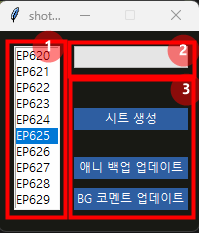

# shotgun-spreadsheet-integration

_2023.11.20 ~_

> shotgun_api3와 gspread를 이용해 shotgun의 데이터를 fetching해와, 구글 스프레드 시트에 자동으로 시트를 생성하고, 업데이트할 수 있는 위젯입니다.

# 🎉 초기 셋팅

> 초기 셋팅임으로 셋팅이 모두 완료됐다면 더 이상 하지 않아도 됩니다.

1. shotgun Legacy Login password 셋팅

2. Access token 발급 및 개인 계정에 bind

 **a. Access token 발급**

> 📌 주의
>   토큰 코드는 타인에게 공유해서는 안되며, 복사해서 가지고 있어야 합니다.
> 만일 토큰 코드를 분실했다면, 재발급 받습니다.

 **b. 계정에 Access Token Bind**

In good standing으로 뜨면 성공적으로 bind된 것입니다.

3. .env 파일 수정

1. 폴더에 포함된 `.env`파일을 메모장으로 연다.
2. `LOGIN`, `PASSWORD` 부분을 자신의 샷건 아이디와 비밀번호를 적어준다.
   - 이때 쌍따옴표 `(")`를 삭제해서는 안된다.
3. `.env`파일을 저장한다.

4.`shotgun-googlesheet-app.exe` 실행

# 👀 위젯 UI

1. 각 에피소드를 listbox로 보고 선택할 수 있습니다.
2. 진행바
3. 선택한 에피소드를 누르고 각 버튼을 누르면 각 버튼에 연계된 event가 실행됩니다.

 

# 🔎 기능

## 1. 새로운 시트 생성

>템플릿으로 존재하는 `worksheet`를 `duplicate`메소드를 이용해 복제한뒤, 해당 시트에 추가할 data를 `update_cells`를 통해 추가하는 방식

### ERROR 처리

| ERROR 이름                                | 상황                                                                                   |
| ----------------------------------------- | -------------------------------------------------------------------------------------- |
| 이미 존재하는 시트입니다.                 | 생성하려는 시트와 동일한 이름인 시트가 존재해서 추가로 생성할 수 없습니다.             |
| shot 데이터가 없습니다.                   | 생성하려는 에피소드의 shot 데이터가 0개일 때 발생합니다.                               |
| 레거시 로그인 비밀번호를 발급 받아주세요. | [시작 탭](#🎉-초기-셋팅)에서 `1. shotgun Legacy Login password 셋팅`을 참고해주세요.    |
| access token 발급 및 바인드 해주세요.     | [시작 탭](#🎉-초기-셋팅)에서 `2. Access token 발급 및 개인 계정에 bind`을 참고해주세요. |

## 2. 애니 백업 업데이트

### ERROR 처리

| ERROR 이름                                | 상황                                                                                   |
| ----------------------------------------- | -------------------------------------------------------------------------------------- |
| 존재하지 않는 시트입니다.                 | 존재하지 않는 시트임으로 업데이트를 중단합니다.                                        |
| shot 데이터가 없습니다.                   | 생성하려는 에피소드의 shot 데이터가 0개일 때 발생합니다.                               |
| 레거시 로그인 비밀번호를 발급 받아주세요. | [시작 탭](#🎉-초기-셋팅)에서 `1. shotgun Legacy Login password 셋팅`을 참고해주세요.    |
| access token 발급 및 바인드 해주세요.     | [시작 탭](#🎉-초기-셋팅)에서 `2. Access token 발급 및 개인 계정에 bind`을 참고해주세요. |

## 3. BG comments 업데이트

### ERROR 처리

| ERROR 이름                                | 상황                                                                                   |
| ----------------------------------------- | -------------------------------------------------------------------------------------- |
| 존재하지 않는 시트입니다.                 | 존재하지 않는 시트임으로 업데이트를 중단합니다.                                        |
| shot 데이터가 없습니다.                   | 생성하려는 에피소드의 shot 데이터가 0개일 때 발생합니다.                               |
| 레거시 로그인 비밀번호를 발급 받아주세요. | [시작 탭](#🎉-초기-셋팅)에서 `1. shotgun Legacy Login password 셋팅`을 참고해주세요.    |
| access token 발급 및 바인드 해주세요.     | [시작 탭](#🎉-초기-셋팅)에서 `2. Access token 발급 및 개인 계정에 bind`을 참고해주세요. |

 

# 🏷️ Stack

 and library

