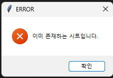

# shotgun-spreadsheet-integration

_2023.11.20 ~_

> shotgun_api3와 gspread를 이용해 shotgun의 데이터를 fetching해와, 구글 스프레드 시트에 자동으로 시트를 생성하고, 업데이트할 수 있는 위젯입니다.

# 👀 위젯 UI

1. 각 에피소드를 listbox로 보고 선택할 수 있다.
2. 진행바
3. 선택한 에피소드를 누르고 각 버튼을 누르면 각 버튼에 연계된 event가 실행된다.

 

# 🔎 기능

## 1. 새로운 시트 생성

>템플릿으로 존재하는 `worksheet`를 `duplicate`메소드를 이용해 복제한뒤, 해당 시트에 추가할 data를 `update_cells`를 통해 추가하는 방식

### ERROR 처리

1. 이미 있는 시트인 경우

    

    `gspread.exceptions.APIError` 예외 처리를 이용해서 경고창으로 시트 생성을 막습니다.

2. 아직 shot data가 없는 경우

    

    shotgun_api3를 통해 데이터를 list 형태로 fetching해올 때, `배열의 값이 비어있을 경우` 경고창으로 시트 생성을 막습니다.

## 2. 애니 백업 업데이트

### ERROR 처리

1. 존재하지 않는 시트인 경우

    

    `gspread.exceptions.WorksheetNotFound`예외 처리를 이용해서 경고창으로 애니 백업 업데이트를 막습니다.

## 3. BG comments 업데이트

### ERROR 처리

1. 존재하지 않는 시트인 경우

    

    `gspread.exceptions.WorksheetNotFound`예외 처리를 이용해서 경고창으로 애니 백업 업데이트를 막습니다.

 

# 🏷️ Stack

 and library

